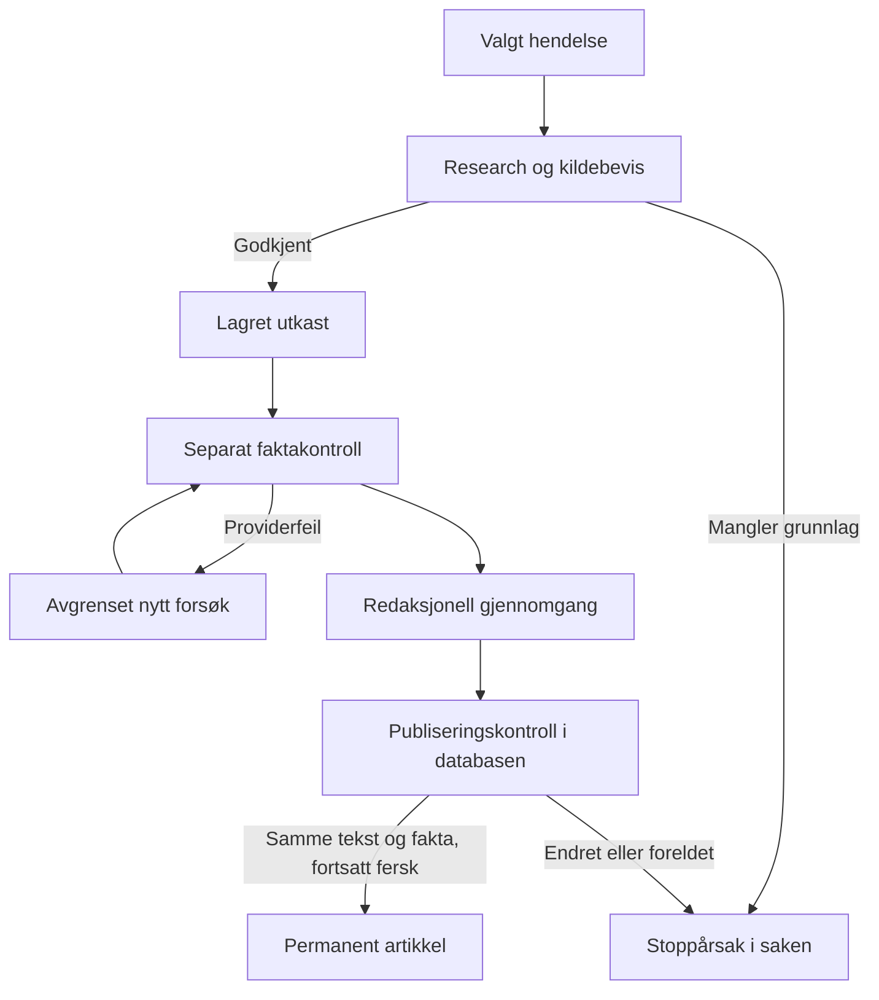

# Sammenhengende redaksjonsflyt – første leveranse

Denne endringen beholder DeepSeek og dagens Next.js/Neon-oppsett. Den kobler
utvelgelse, research, utkast, kontroll og publisering til **én identifiserbar sak**.
Den er laget for gjennomgang og testing før aktivering i produksjon.

## Hva som endres

| Tidligere problem | Ny oppførsel |
| --- | --- |
| Deljobber bruker løse radarflagg og kan behandle samme hendelse flere ganger | `editorial_cases` har én hendelsesnøkkel, én radarreferanse, fast rundetilhørighet og låsing per arbeidssteg |
| Faktapakken kan endres uten at kontrollen av artikkelen følger med | Saksgrunnlag, kildeutdrag, faktapakke og artikkeltekst bindes til bestemte versjoner med SHA-256 |
| Et vilkårlig `/news`-domene kan fremstå som selskapskilde | Kontrollerte domener og eksplisitte koblinger mellom selskap og domene |
| Discovery-tekst eller en kalender kan bli faktagrunnlag | Hentet dokument, original publiseringsmetadata og ordrette kildeutdrag kreves; indekssider avvises |
| Tallkontroll ser bare etter om samme talltegn finnes | Et separat DeepSeek-kall vurderer hver tekstblokk med aktør, enhet, valuta, periode og fakta-ID |
| Feil i kontrollkallet utløser ny artikkelskriving | Utkast og skriveforbruk lagres først; kontrollen har sitt eget forsøk og egen gjenoppretting |
| Gamle jobber kan holde en nyere runde åpen | Køen leser bare den aktive rundens saker, har avgrensede forsøk og stopper ny research ved utkastgrensen |
| Senere discovery kan forlenge en eksisterende rangeringsrunde | Runden lagrer et tidspunkt som avgrenser hvilke kandidater den rangerer |
| Mange gjentatte schema-kall per forespørsel | Eldre initieringsfunksjoner deler arbeid og caches per databaseklient; ny sakstabell opprettes ved eksplisitt migrasjon |

Fullrunden publiserer ikke lenger egne live-oppdateringer ved utvelgelse.
Den eksisterende femminutters live-pulsen eier live-strømmen. Denne leveransen
er først og fremst en endring av **fullartikkelløypen**, ikke en ferdig revisjon
av live-motor, forsideprioritering, scheduler eller alle discovery-kilder.

## Saksflyt og lagring

`editorial_cases.dossier` beholder utvelgelsesbegrunnelse, discovery-kilde,
hentede kilder, originaldato, kildehash, fakta med ordrette utdrag,
utkastversjon og kontrollresultat. Full kildetekst kopieres ikke inn i saken.
`editorial_case_events` registrerer fullførte steg og feil.
`fact_packs`, `articles`, `article_provenance` og saksstatus oppdateres sammen
i transaksjoner. Eksisterende artikkelslug bevares ved regenerering.

Hvert steg får en tilfeldig låsetoken og en frist på fire minutter.
Arbeid som er overtatt av en annen kjøring, får ikke lagre gamle resultater.
Et automatisk steg har maksimalt tre forsøk per saksgrunnlag, med to minutters
pause etter feil. Manuell ny research, regenerering og ny kontroll er eksplisitte
handlinger; en aktiv lås kan aldri overtas med en manuell overstyring.

Publisering krever at artikkeltekst og faktapakke fortsatt samsvarer med
kontrollen. Dette sjekkes både i applikasjonen og med låste rader i PostgreSQL.
Endring av tekst eller faktagrunnlag nullstiller kontrollstatus. Ny research
beholder et eksisterende utkast, men gjør tidligere godkjenning ugyldig.

Standard aldersterskel for fullartikler er 36 timer fra dokumentert originaldato,
med maksimalt 15 minutters fremtidig klokkeavvik. Grensen gjelder igjen ved
publisering, også ved manuell publisering og gjenoppretting. Live-pulsens egen
aldersgrense endres ikke av denne leveransen.

## Gjennomgangsmodus

`EDITORIAL_AUTOPUBLISH_V1` må være nøyaktig `true` før den nye løypen kan
autopublisere. I tillegg må eksisterende publiseringsbryter være på. Uten
miljøvariabelen produseres utkast til gjennomgang. Bryteren for all automatikk
fungerer fortsatt som tidligere.

Manuell publisering av en AI-sak går gjennom samme faktakontroll. Eldre
AI-utkast uten saksgrunnlaget fra denne versjonen kan ikke publiseres gjennom
den nye kontrollen. «Lag nytt AI-utkast» bygger først nytt kildegrunnlag.
Helt manuelt opprettede artikler følger eksisterende redaktørflyt.

`/redaksjon/saker` viser de siste 50 sakene med utvelgelsesgrunn, dato, tilstand,
stoppårsaker og lenke til utkast. Utkastsiden viser fakta og kildebevis og har
en egen knapp for å kontrollere et redigert utkast. Den manuelle kjøringen viser
venting, kontroll og feil og respekterer pausen mellom forsøk.

## Database og aktivering

Dette er en additiv migrasjon. Ingen eksisterende artikler eller URL-er slettes.
Saker beholder nødvendige radar- og faktareferanser; støyrydding hopper over
referanser som databasen beskytter. Migrasjonen forutsetter de eksisterende
tabellene `articles`, `radar_items`, `fact_packs` og `editorial_runs`, samt
dagens artikkelfelter. Den er ikke en komplett førstegangsoppretting av avisen.

1. Bekreft aktuell GitHub-commit og faktisk Vercel Production-commit. Stans
   automatiske fullrunder mens database og kode byttes. Bruk én avtalt testdatabase;
   ikke opprett Neon-grener for hver PR eller bygging.
2. Legg testdatabasens direkte URL i `DATABASE_URL_UNPOOLED`, vanlig
   applikasjonstilkobling i `DATABASE_URL`, og DeepSeek-nøkkelen i riktig
   miljø. Bruk miljøvariabler eller lokal `.env.local`, aldri repo eller PR.
3. Kjør `npm ci`, `npm test` og `npm run db:migrate` mot testdatabasen.
   Migratoren bruker en transaksjonslås, sjekksum og migrasjonsjournal.
   Gjentatt kjøring er tillatt. Endring av en allerede brukt migrasjon avvises.
4. Bygg og test den konkrete committen med `EDITORIAL_AUTOPUBLISH_V1=false`.
   Se at research, utkast, separat kontroll, manuell redigering og ny kontroll
   gir riktige rader og kildebevis. Kontroller også to reelt samtidige klienter.
5. Vurder 30–50 **ekte** kandidater og utkast med DeepSeek. Før en enkel journal
   over norsk relevans, korrekt hendelse/dato, faktafeil, avslag og faktisk
   API-forbruk. De automatiske testene erstatter ikke denne vurderingen.
6. Når dette er gjennomgått: kjør samme migrasjon mot valgt produksjonsdatabase,
   deploy godkjent commit og bekreft både Production-versjon og live-adresser.
   Start fullrunder i gjennomgangsmodus før eventuell autopublisering aktiveres.

Uten migrasjonen stopper den nye artikkelmotoren med `MIGRATION_REQUIRED`.
Koden forsøker ikke å opprette de nye tabellene ved sidevisning eller cron-kall.
Aktivering av koden før migrasjonen vil derfor stoppe nye fullrunder.

Ved problemer: stopp automatikk og sett `EDITORIAL_AUTOPUBLISH_V1=false`.
Behold de additive tabellene. Rull eventuelt kode tilbake med automatikk avslått;
eldre kode håndhever ikke de nye publiseringskontrollene.

## Verifisering og begrensninger

Testene bruker appens faktiske research-, skrive-, kontroll- og køkode mot
PGlite, som kjører PostgreSQL lokalt. SQL, constraints, PL/pgSQL-funksjoner,
transaksjonsrollback og låsetoken testes. Eksterne kilder og DeepSeek-svar er
kontrollerte testdata. Testene dekker blant annet gamle nyheter, manglende
originaldato, falske kildeutdrag, ufullstendig kontroll, endret artikkel,
duplikatregistrering, overlappende arbeid, utløpt lås, kontrollfeil uten
omskriving, migrasjonsfeil og avslutning av riktig runde.

PGlite har én databaseforbindelse. Testene erstatter derfor **ikke** en
test av Neon HTTP-driveren, flere samtidige forbindelser eller virkelige
nettverksavbrudd. Disse kontrollene ble supplert med ekte Neon- og DeepSeek-kjøring 21. september
2026 (GitHub Actions-kjøring `35582122124`, commit `de3e5bb`):

- Migrasjonen ble kjørt samtidig fra to klienter og registrert nøyaktig én gang.
- To arbeidere konkurrerte om samme sak; bare én fikk låsen. En utløpt arbeider
  ble nektet lagring etter at en ny arbeider overtok.
- Ekte discovery, dokumenthenting og DeepSeek-research produserte en faktapakke
  med ti fakta. Artikkelutkastet ble lagret i testdatabasen før separat kontroll.
- Kontrolløren avviste to tekstblokker uten tilstrekkelig støtte. Utkastet ble
  beholdt for gjennomgang og kunne ikke publiseres. Tre andre kandidater ble
  stoppet før skriving. Ingen tekniske feil i den fullførte kjøringen.
- 69 automatiske tester og Next.js-produksjonsbygg bestod.

Dette dokumenterer teknisk sammenheng, **ikke** tilfredsstillende redaksjonell
kvalitet eller stabil drift over flere døgn. Det ene utkastet er ikke godkjent
for publisering. Automatisk publisering skal derfor fortsatt være avslått.

RSS/GDELT-discovery har ti sekunders timeout per kall. Strukturert research,
skriving og kontroll bruker samme betalte DeepSeek-modell uten thinking og
med maksimalt 120 sekunder per forespørsel. Research forsøker høyst tre ekstra
kildedokumenter innenfor arbeidslåsens fire minutter. Avbrudd under lesing av
providersvaret rapporteres som tidsavbrudd; avkortet JSON godtas ikke.

Gjenværende grenser:

- Norsk relevans er foreløpig en tydelig lokal regelmodell som påvirker rangering,
  ikke en ferdig kalibrert digital desk. Den vil overse noen gode saker.
- Bare eksplisitt publiseringsmetadata med klokkeslett/tidssone godtas nå.
  PDF-er, sider med bare dato og enkelte offisielle dokumenttyper kan derfor
  stoppes. Dette krever dokumenttilpassede dato-lesere før bred dekning.
- Ordrett utdrag dokumenterer hvor tekst kommer fra, men beviser ikke alene at
  AI har tolket teksten riktig. Kontroll med samme modellfamilie kan også feile.
- Domeneoversikten er bevisst avgrenset. Flere kilder må legges til som konkrete,
  verifiserte domener; en generell `/news`-regel skal ikke gjeninnføres.
- Eldre schema-hjelpere finnes fortsatt og utfører DDL ved første kjøring i en
  ny prosess. Caching fjerner gjentakelser; full flytting til migrasjoner gjenstår.
- Tokenbruk lagres fra vellykkede providersvar. Kostnadsberegning bruker eksisterende
  estimater. Forbruk ved avbrutt svar er ukjent og må sammenholdes med fakturering.
- Adminautentisering, bilder, SEO, selvstendig forsideeditor og driftstest over
  flere døgn inngår ikke her. Eksisterende adminbeskyttelse må fortsatt ordnes før launch.

## Utgangspunkt og produksjonsstatus

### Lesekontroll før aktivering

Workflowen `Editorial database readiness (read only)` undersøker tilgjengelige
Production- og Preview-forbindelser med eksplisitte read-only-transaksjoner.
Vercel-variabler merket `sensitive` / `secret` kan ikke hentes ut, og kontrollen
endrer ikke denne beskyttelsen. Den installerte Neon-koblingen svarte fortsatt
`Tool list_projects not found` ved kontroll 20. september 2026.

En alternativ testforbindelse kan legges i GitHub Actions-secret
`EDITORIAL_TEST_DATABASE_URL_UNPOOLED` på dette repoet. Bruk direkte URL fra
én separat Neon-testgren med kopi av dagens skjema. Ikke legg URL-en i kode,
PR eller chat. Kjør kontrolljobben på `codex/redaksjon-sammenheng` på nytt
etter at secret er lagt inn. Rapporten viser `test.connected` ved vellykket
testtilkobling; samlet `ok` forblir false hvis Production ikke er undersøkt.
Dette er kun lesekontroll: jobben migrerer ikke, publiserer ikke artikler og
gjør ingen DeepSeek-kall. En grønn kontroll erstatter ikke migrasjons- og
flyttestene i aktiveringsplanen over.

Implementasjonen startet fra `main` på
`3f9c823e82271b7ef444108fd5cce5b50a8bbfc2`, som også ble bekreftet som Vercel
Production ved oppstart. Denne leveransen er et separat endringsforslag.
En vellykket lokal test eller PR-bygg betyr ikke at endringen kjører i produksjon.

### Kontrollert produksjonsutrulling

`Prepare editorial production database` krever den vellykkede Neon-kjøringen
angitt over og identisk migrasjonssjekksum i testdatabasen. Den krever at begge
automatikkbrytere er av, migrerer additivt, kontrollerer uendret artikkelantall
og setter produksjonens DeepSeek-nøkkel samt `EDITORIAL_AUTOPUBLISH_V1=false`.
Database-URL-er overskrives ikke i Vercel; Neon-integrasjonen beholdes.

Etter merge venter `Activate editorial review mode` på at produksjonens
`/api/health` viser nøyaktig merge-commit, nytt skjema og gjennomgangsmodus.
Først da aktiveres automatikk med publiseringsbryteren fortsatt av. Workflowen
kjører deretter en vanlig redaksjonsrunde med eksisterende cron-autentisering.
Den deler samtidighetsgruppe med den ordinære scheduler-jobben.

Secrets leses bare i GitHub Actions. Test og produksjon må peke til ulike
Neon-endepunkter. Pooled URL-er normaliseres til samme grens direkte endepunkt.
En vellykket migrasjon alene er ikke bevis for at ny kode er live; sjekk alltid
GitHub main, Vercel Production og responsen fra produksjonsdomenet.
